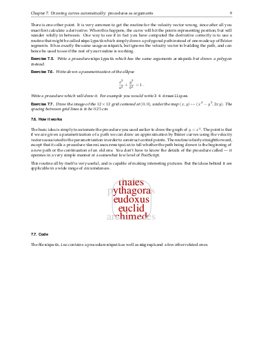
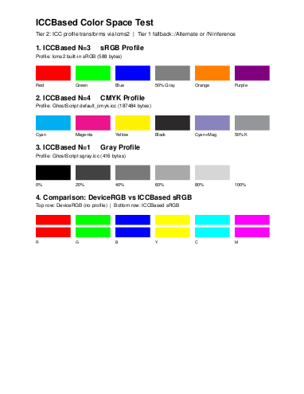
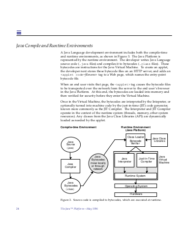

<h1 align="center">PostForge</h1>

<p align="center"><strong>A modern, open-source PostScript interpreter written in Python.</strong></p>

<p align="center">
  <a href="https://github.com/AndyCappDev/postforge/releases"></a>
  <a href="LICENSE.txt"></a>
  <a href="https://www.python.org/downloads/"></a>
</p>

## About

PostForge is a complete PostScript interpreter that faithfully implements the
PostScript Level 2 specification while adding selected Level 3 enhancements.
It reads PostScript files and produces PNG images, PDF documents, SVG files,
or renders them in an interactive Qt display window.

PostForge is designed as an open-source alternative to GhostScript for use
cases where Python integration, transparency, and debuggability matter more
than raw speed. Its modular architecture makes it well suited for education,
PostScript development, and embedding in Python workflows.

The interpreter covers the full Level 2 specification and includes PDF font
embedding/subsetting, ICC color management, and a Cython-accelerated execution loop.

## Sample Output

<p align="center">
  <table align="center">
    <tr>
      <td></td>
      <td></td>
    </tr>
    <tr>
      <td></td>
      <td></td>
    </tr>
    <tr>
      <td></td>
      <td></td>
    </tr>
  </table>
</p>

See the [sample gallery](docs/samples.md) for larger rendered examples.

## Features

- **Full Level 2 Implementation** — Strict Level 2 compatibility with
  selected Level 3 enhancements that don't break Level 2 programs
- **Interactive Executive Mode** — Built-in PostScript command line for live
  exploration, debugging, and experimentation
- **Cython-Accelerated Execution** — Optional Cython-compiled execution loop
  providing 15–40% speedup depending on workload
- **Multiple Output Formats** — PNG, PDF, and SVG output via Cairo graphics
  backend, plus an interactive Qt display window with a PostScript command
  prompt; extensible architecture makes it straightforward to add new devices
- **PDF Font Embedding** — Type 1 font reconstruction and subsetting,
  TrueType/CID font extraction with CIDToGIDMap and ToUnicode support
- **EPS Support** — Automatic page cropping to EPS content dimensions with
  HiResBoundingBox precision; handles DOS EPS binary format
- **ICC Color Management** — sRGB, CMYK, and Gray ICC profiles via lcms2,
  with tiered fallback for color accuracy
- **PostScript-Based Test Suite** — 2,500+ unit tests written in PostScript,
  using a custom assertion framework that tests the interpreter from the
  language level
- **Memory Analysis Tools** — Built-in profiling, garbage collection analysis,
  and leak detection for debugging and optimization

## Installation

### Linux

```bash
git clone https://github.com/AndyCappDev/postforge.git
cd postforge
./install.sh
```

The install script checks for Python 3.13+ and Cairo, creates a virtual
environment, installs all dependencies, builds the optional Cython
accelerator, and installs the `pf` command system-wide via `/usr/local/bin`.
If anything is missing, it will tell you which package to install for your
distribution (Debian/Ubuntu, Fedora, RHEL/CentOS, Arch, openSUSE).

For the Cython-accelerated execution loop (15–40% speedup), a C compiler
is needed. Install it before running `./install.sh`:

| Distribution | Command |
|---|---|
| Debian/Ubuntu | `sudo apt install build-essential` |
| Fedora | `sudo dnf install gcc` |
| Arch | `sudo pacman -S base-devel` |
| RHEL/CentOS | `sudo yum install gcc` |
| openSUSE | `sudo zypper install gcc` |

PostForge works without a C compiler — the install script will skip the
Cython build and use a pure Python fallback.

### macOS

```bash
git clone https://github.com/AndyCappDev/postforge.git
cd postforge
./install.sh
```

Requires [Homebrew](https://brew.sh/). The install script will check for
Python 3.13+ and Cairo, and tell you what to install if anything is missing.

Installing Cairo via Homebrew requires Xcode Command Line Tools
(`xcode-select --install`), which also provides the C compiler needed for
the Cython-accelerated execution loop (15–40% speedup). Both are built
automatically by the install script.

### Windows

```cmd
git clone https://github.com/AndyCappDev/postforge.git
cd postforge
install.bat
```

The install script checks for Python 3.13+, creates a virtual environment,
installs all dependencies, builds the optional Cython accelerator, and adds
PostForge to your PATH so the `pf` command works from any terminal. Open a
new terminal after installation for the PATH change to take effect.

**Prerequisites:** Install [Python 3.13+](https://www.python.org/downloads/)
and check **"Add Python to PATH"** during installation. Cairo is bundled
with the pycairo package on Windows — no separate install needed.

For the Cython-accelerated execution loop (15–40% speedup), install
[Microsoft C++ Build Tools](https://visualstudio.microsoft.com/visual-cpp-build-tools/)
and select the **"Desktop development with C++"** workload. PostForge works
without them — the install script will skip the Cython build and use a pure
Python fallback.

### Usage Examples

```bash
# Interactive PostScript prompt
pf

# Render to the Qt display window
pf samples/tiger.ps

# Save as PNG → pf_output/tiger-0001.png
pf -d png samples/tiger.ps

# Save as PDF → pf_output/tiger-0001.pdf
pf -d pdf samples/tiger.ps

# Save as SVG → pf_output/tiger-0001.svg
pf -d svg samples/tiger.ps

# Render an EPS file (auto-crops to content)
pf -d png samples/fancy.eps

# Custom output path → renders/result-0001.png
pf -o result.png --output-dir renders samples/tiger.ps

# Render only specific pages from a multi-page document
pf -d pdf --pages 1-3,7 document.ps

# SVG with text rendered as path outlines instead of <text> elements
pf --text-as-paths -d svg samples/tiger.ps

# Pipe PostScript from stdin
cat document.ps | pf -d png -
```

For complete command line options, see the [User Guide](docs/user/user-guide.md).

### Updating

To update PostForge to the latest version:

```bash
cd postforge
git pull
./install.sh        # Linux/macOS
install.bat          # Windows
```

The install script will update dependencies and rebuild the Cython accelerator
as needed. Your configuration and font cache are preserved.

### Uninstalling

**Linux/macOS:**

```bash
./uninstall.sh
```

Removes the system commands (`pf`, `postforge`), virtual environment, font
cache, and build artifacts. The source code is left in place.

**Windows:**

```cmd
uninstall.bat
```

Removes PostForge from your PATH, the virtual environment, font cache, and
build artifacts. Open a new terminal after uninstalling for the PATH change
to take effect.

## PostForge vs GhostScript

PostForge and GhostScript serve different needs:

| | **PostForge** | **GhostScript** |
|---|---|---|
| **Language** | Python | C |
| **Architecture** | Open, modular, readable | Monolithic, optimized for speed |
| **Best for** | Debugging, education, Python integration, development | Production rendering, printer drivers, full Level 3 |
| **Speed** | Interpreted (with optional Cython) | Fast native execution |
| **PostScript Level** | Level 2 complete, selected Level 3 | Full Level 3 |
| **License** | AGPL-3.0 | AGPL-3.0 |

**Choose PostForge** when you want to understand what a PostScript program is
doing, embed an interpreter in a Python application, develop or debug
PostScript code, or learn how PostScript works.

**Choose GhostScript** when you need maximum rendering speed, full Level 3
compliance, printer support, or a battle-tested production tool.

*That said, don't be fooled by "written in Python" — PostForge is a serious
interpreter with full Level 2 compliance, 2,500+ unit tests, and production-quality
output. It handles complex real-world PostScript files and is plenty fast for
most rendering tasks.*

## Documentation

### For Users
- [User Guide](docs/user/user-guide.md) — Installation, CLI usage, output options

### For Developers
- [Contributing Guide](docs/developer/contributing.md) — Setup, conventions, and PR workflow
- [Architecture Overview](docs/developer/architecture-overview.md) — How PostForge works internally
- [Implementing Operators](docs/developer/operator-implementation.md) — Adding new PostScript operators
- [Testing Guide](docs/developer/testing-guide.md) — Writing and running PostScript-based tests
- [Visual Regression Testing](docs/developer/visual-regression-testing.md) — PNG, PDF, and SVG visual comparison
- [Adding Output Devices](docs/developer/adding-output-devices.md) — Creating new output backends
- [Profiling](docs/developer/profiling.md) — Performance and memory analysis

### Design
- [Level 2 Compliance Assessment](docs/design/level2-compliance-assessment.md)
- [Detailed Gap Analysis](docs/design/detailed-gap-analysis.md)
- [Sample Gallery](docs/samples.md)

## Contributing

PostForge welcomes contributions. See the [Contributing Guide](docs/developer/contributing.md) for setup instructions, code conventions, and PR workflow.

For a quick start:

1. Clone the repository and run `./install.sh` (or `install.bat` on Windows)
2. Read the [Architecture Overview](docs/developer/architecture-overview.md) to understand the codebase
3. Check the [Operator Implementation Guide](docs/developer/operator-implementation.md) for coding standards
4. Run the test suite with `pf unit_tests/ps_tests.ps` to verify your changes

## Requirements

- **Python 3.13+**
- **Cairo** graphics library (system package on Linux/macOS; bundled with pycairo on Windows)
- **Core Python packages**: pycairo, psutil, jpeglib, Pillow, pypdf
- **Optional**: PySide6 (for the interactive Qt display)

## License

Copyright (c) 2025-2026 Scott Bowman

Licensed under the GNU Affero General Public License v3.0 (AGPL-3.0-or-later).
See [LICENSE.txt](LICENSE.txt) for the full license text.
