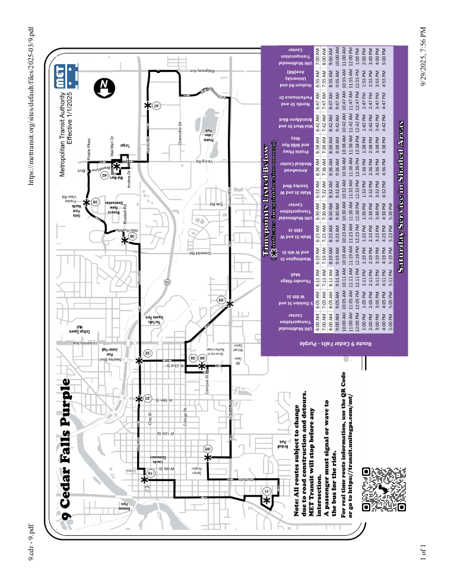
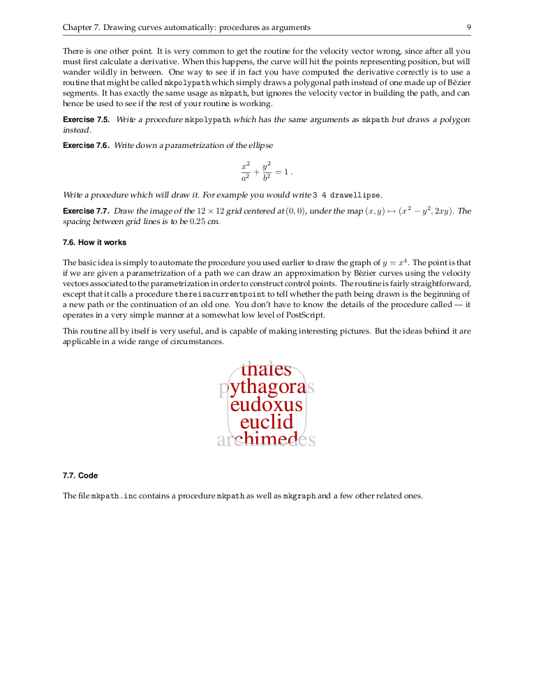
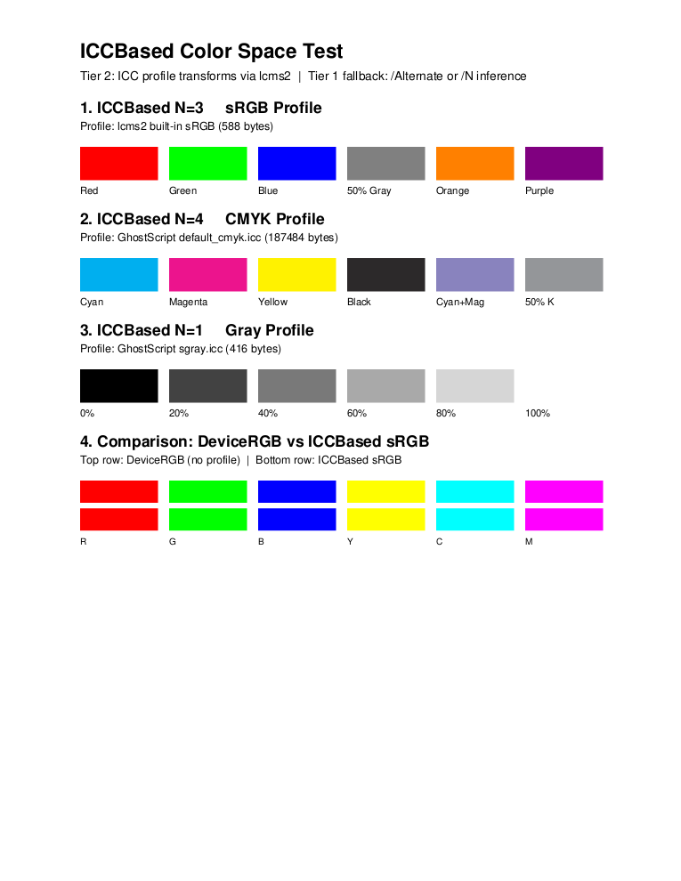
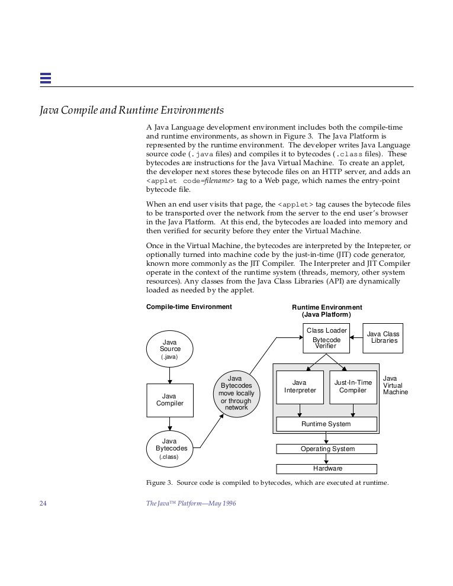

# PostForge Sample Output

The following images were rendered by PostForge from PostScript source files.
Each image is rendered at 90 DPI to PNG.

---

### Sample 1

---

### Sample 2

---

### Sample 3

---

### Sample 4

---

### Sample 5

---

### Sample 6

